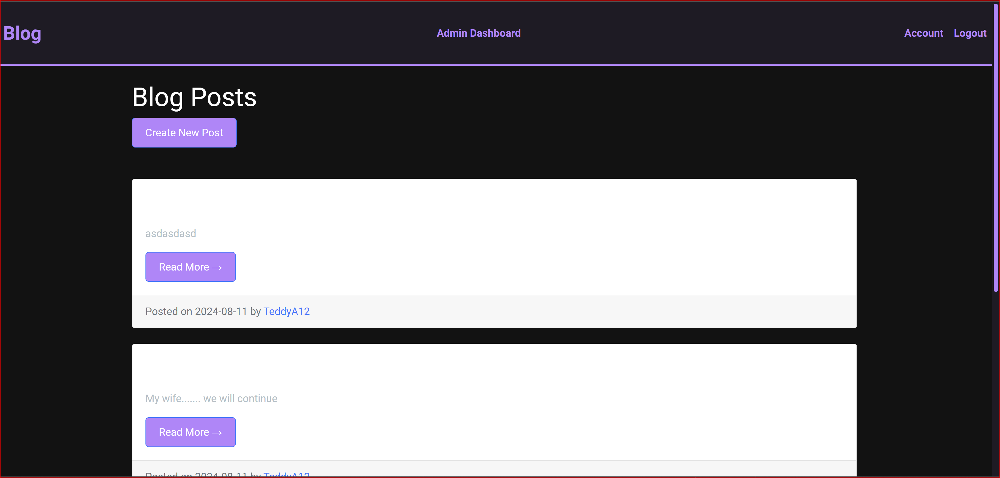
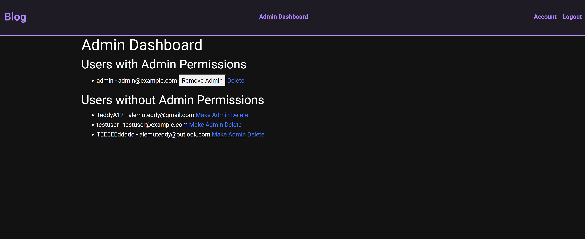

markdown
Copy code
# Blog Website

## Description

This is a Flask-based blog application that allows users to register, log in, create posts, and manage their accounts. It also includes an admin dashboard where administrators can manage users, promote them to admin, and delete accounts.

The application is designed with a modern dark theme and includes user authentication, post management, and admin functionalities. The app can be run locally or within a Docker container, making it easy to deploy and scale.

## Features

- User registration and login
- Post creation, editing, and deletion
- Admin dashboard for managing users and posts
- Dark-themed UI with responsive design
- Docker support for easy deployment

## Technologies Used

- **Python 3.10**
- **Flask**
- **Flask-Login**
- **Flask-Bcrypt**
- **Flask-Migrate**
- **Flask-WTF**
- **SQLAlchemy**
- **SQLite** (default database)
- **Docker**

## Setup Instructions

### 1. Clone the Repository

git clone https://github.com/LordUzumaki/BlogWebsite.git

cd BlogWebsite

## Set Up the Environment
Create a virtual environment (optional but recommended):

**python3 -m venv venv**
**source venv/bin/activate  # On Windows use `venv\Scripts\activate`**
## Install Dependencies
- Install the required Python packages:

- pip install -r requirements.txt

## Set Up the Database
Initialize the database:

- flask db init
- flask db migrate -m "Initial migration"
- flask db upgrade

## Running the Application Locally
To run the application locally without Docker:

Run the Flask Application:

python app.py
Access the Application:

## Open your web browser and go to http://localhost:5500.

## Running the Application with Docker
Build the Docker Image:

**docker-compose build**
 - Run the Docker Container:

 - docker-compose up

**Access the Application:**

Open your web browser and go to http://localhost:5500.

## Admin Dashboard

**To access the admin dashboard:**

**Login as Admin:**

- **The application automatically creates an admin user with the following credentials:**

- Username: **admin**
- Password: **adminpassword**

You can change these credentials by modifying the create_admin_user function in app.py.

Manage Users and Posts:

After logging in as an admin, go to http://localhost:5500/admin_dashboard to manage users and their permissions.

## Docker Commands
**Here are some useful Docker commands:**

- Stop the Docker Containers:

- docker-compose down

**Remove all Containers, Networks, and Volumes:**

- docker-compose down --volumes

**Access the Running Container:**

- docker-compose exec web bash

## Blog Website

**Front page after logging in**

**Admin Permission control**

